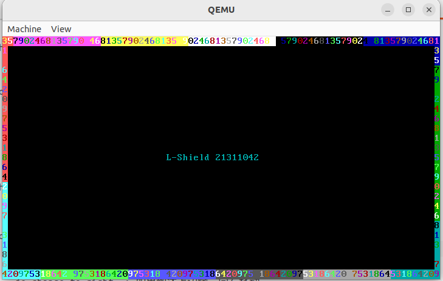
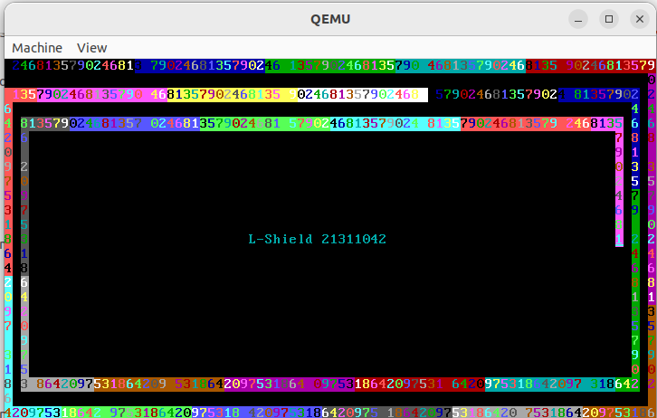

# 实验任务

本次实验包括4个 Assignment，请大家仔细阅读 [README.md](./README.md) 文件后完成实验。

**请注意，今年的实验有部分改动，与往年不一样，请大家千万不要抄袭往年的代码；如果使用大模型写的代码，也请务必标注出来，老师和助教会有查重，以避免抄袭行为！**

实验的DDL是 **2026.03.24 23:59**

## 实验环境

本实验支持在 **Ubuntu** 和 **麒麟操作系统（Kylin OS）** 上完成。

**基础工具安装：**

| 工具 | Ubuntu | 麒麟OS |
|------|--------|--------|
| 汇编器 + 模拟器 | `sudo apt install nasm qemu-system-x86 gdb make` | `sudo yum install nasm qemu-system-x86_64 gdb make` |

> **说明：**
> - 如果麒麟OS上没有 `qemu-system-i386` 命令，可使用 `qemu-system-x86_64` 代替，效果完全一致。
> - NASM 是跨平台的 x86 汇编器，在 ARM64 架构上也能正确编译 x86 汇编代码。

## 提交内容

将 **4个 Assignment 的代码** 和 **实验报告** 放到 **压缩包** 中，命名为"**lab2-姓名-学号**"，并交到[课程网站](http://course.dds-sysu.tech/course/18/homework)上。

实验报告中请注明你的实验环境（操作系统版本、CPU架构），并对每个 Assignment 说明实现思路和结果截图。

## Assignment 1 MBR

> 注意，Assignment 1 的寄存器请使用16位的寄存器。

### 1.1 复现 Example 1

复现 README.md 中 Example 1 的 Hello World 程序。说说你是怎么做的（包括编译、写入磁盘、启动 QEMU 的完整步骤），并将结果截图。

> **麒麟OS用户提示：** 启动命令使用 `qemu-system-x86_64 -hda hd.img -serial null -parallel stdio` 代替 `qemu-system-i386`。

### 1.2 自定义输出

请修改 Example 1 的代码，使得 MBR 被加载到 0x7C00 后在 **(16, 10)** 处开始输出你的学号。注意，你的学号显示的前景色和背景色必须和教程中不同。说说你是怎么做的，并将结果截图。

> **提示：** 回顾显存地址的计算公式 $\text{显存起始位置} = \text{0xB8000} + 2 \cdot (80 \cdot x + y)$，其中 $(x, y)$ 表示第 $x$ 行第 $y$ 列。

### 1.3 循环输出（新增）

请使用循环和数据标号来改写 1.2 的代码，将学号字符串存储在数据标号中，通过循环依次输出每个字符，而非逐个字符手动赋值。说说你是怎么做的，并将结果截图。

> **提示：** 参考 README.md 中课后思考题第15题的代码结构，思考 `org 0x7c00` 对标号地址的影响。

## Assignment 2 实模式中断

参考资料如下。

- [OSDev 关于 BIOS 的介绍](https://wiki.osdev.org/BIOS)
- [BIOS 中断表](http://www.ctyme.com/rbrown.htm)
- [VIDEO - WRITE CHARACTER ONLY AT CURSOR POSITION](http://www.ctyme.com/intr/rb-0100.htm)
- [VIDEO - WRITE CHARACTER AND ATTRIBUTE AT CURSOR POSITION](http://www.ctyme.com/intr/rb-0099.htm)
- [VIDEO - WRITE STRING (AT and later,EGA)](http://www.ctyme.com/intr/rb-0210.htm)
- [VIDEO - GET CURSOR POSITION AND SIZE](http://www.ctyme.com/intr/rb-0088.htm)
- [10h中断](https://zh.wikipedia.org/wiki/INT_10H)

2.1和2.2使用的都是实模式中断`int 10h`，由于功能号不同，执行的结果也就不同。在[`int 10h`中断的资料](https://zh.wikipedia.org/wiki/INT_10H) 中，其只给出10h中断下各个功能号的用途，并未给出实际的用法。因此，同学们可能一开始会感觉不知所云，教程下面给出同学们完成本次实验需要用到的功能号。

| 功能                       | 功能号 | 参数                                         | 返回值                                           |
| -------------------------- | ------ | -------------------------------------------- | ------------------------------------------------ |
| 设置光标位置               | AH=02H | BH=页码，DH=行，DL=列                        | 无                                               |
| 获取光标位置和形状         | AH=03H | BX=页码                                      | AX=0，CH=行扫描开始，CL=行扫描结束，DH=行，DL=列 |
| 在当前光标位置写字符和属性 | AH=09H | AL=字符，BH=页码，BL=颜色，CX=输出字符的个数 | 无                                               |

注意，“页码”均设置为0。

一般地，中断的调用方式如下。

```
将参数和功能号写入寄存器
int 中断号
从寄存器中取出返回值
```

### 2.1

请探索实模式下的光标中断，**利用中断实现光标的位置获取和光标的移动**。说说你是怎么做的，并将结果截图。

### 2.2

请修改1.2的代码，**使用实模式下的中断来输出你的学号**。说说你是怎么做的，并将结果截图。

### 2.3

在2.1和2.2的知识的基础上，探索实模式的键盘中断，**利用键盘中断实现键盘输入并回显**，可以参考[该资料](https://blog.csdn.net/deniece1/article/details/103447413)。关于键盘扫描码，可以参考[该资料](http://blog.sina.com.cn/s/blog_1511e79950102x2b0.html)。说说你是怎么做的，并将结果截图。

## Assignment 3 汇编

> - Assignment 3 的寄存器请使用32位的寄存器。
> - **你需要实现的代码文件在 `assignment/student.asm` 中。**
> - 编写好代码之后，在目录 `assignment` 下**使用命令 `make run` 即可测试**，不需要放到 MBR 中使用 QEMU 启动。
> - `a1`、`if_flag`、`my_random` 等都是预先定义好的变量和函数，直接使用即可。
> - 你可以修改 `test.cpp` 中的 `student_setting` 中的语句来得到你想要的 `a1`。（请尽可能多测试几组样例，以有充分的理由说明你的代码是对的）
> - 最后附上 `make run` 的截图，并说说你是怎么做的。

**环境安装：**

| 系统 | 安装命令 |
|------|----------|
| **Ubuntu（x86_64）** | `sudo apt install gcc-multilib g++-multilib` |
| **麒麟OS（x86_64）** | `sudo yum install gcc-c++ glibc-devel.i686 libstdc++-devel.i686` |
| **ARM64（麒麟OS等）** | 见下方说明 |

> **ARM64 用户说明：** ARM64 架构上无法直接安装 `gcc-multilib` 或 `glibc-devel.i686` 来编译32位 x86 程序。如果你使用的是 ARM64 架构的麒麟OS，请选择以下方案之一完成 Assignment 3：
> 1. **远程编译：** 通过 SSH 连接到一台 x86_64 机器上完成编译和测试。
> 2. **容器方案：** 使用 Docker/Podman 运行 x86_64 的 Ubuntu 容器：
>    ```shell
>    # 安装 Docker 后运行（需要 QEMU user-mode 支持）
>    docker run --platform linux/amd64 -it ubuntu:22.04 bash
>    # 在容器内安装工具
>    apt update && apt install -y nasm gcc-multilib g++-multilib make
>    ```
> 3. **仅完成汇编部分：** 编写 `student.asm` 中的汇编代码，在报告中说明算法思路，然后在可用的 x86_64 环境中验证结果。

### 3.1 分支逻辑的实现

请将下列伪代码转换成汇编代码，并放置在标号`your_if`之后。

```
if a1 >= 40 then
	if_flag = (a1 + 3) / 5
else if a1 >= 18 then
	if_flag = 80 - (a1 * 2)
else
	if_flag = a1 << 5
end
```

> 特别提醒，在使用除法的时候，你可能会遇到浮点数异常报错，请自行查询资料，了解`idiv`指令的用法。注意 `idiv` 执行前需要对 `edx:eax` 进行符号扩展（使用 `cdq` 指令）。

### 3.2 循环逻辑的实现

请将下列伪代码转换成汇编代码，并放置在标号`your_while`之后。

```
while a2 < 25 then
	call my_random        // my_random将产生一个随机数放到eax中返回
	while_flag[a2 * 2] = eax
	++a2
end
```

### 3.3 函数的实现

请编写函数`your_function`并调用之，函数的内容是遍历字符数组`your_string`。

```
your_function:
	for i = 0; your_string[i] != '\0'; ++i then
		pushad
		push (your_string[i] + 9) to stack
		call print_a_char
		pop stack
		popad
	end
	return
end
```

## Assignment 4 汇编小程序

> Assignment 4 的程序需要放入 MBR 中运行，因此代码不超过510字节。使用 QEMU 启动方式与 Assignment 1 相同。
> 麒麟OS用户同样使用 `qemu-system-x86_64` 代替 `qemu-system-i386`。

**必做：字符回旋程序。** 请你用汇编代码实现一个字符回旋程序，使其能够在 QEMU 显示屏上面，以不同的颜色、字符内容进行顺时针绕圈（见下图）。请注意，对于这个绕圈的字符，你还需要考虑它的运动速度，不要让其运动过快（可自行查阅其他资料，采用合适的中断来实现延时效果）。



> **提示：** 延时效果可以参考以下方法：
> 1. 使用 BIOS 时间中断 `int 15h`（功能号 AH=86h）实现微秒级延时
> 2. 使用端口 I/O 读取 CMOS 时钟（端口 0x70/0x71）
> 3. 使用空循环消耗 CPU 周期（最简单但不精确）

**选做1：向内绕圈。** 如果你认为该任务太简单，你还可以实现一个不断向内绕圈的字符（见下图）。请注意，你需要设置一个期限，不能让它无休止地向内绕圈，导致访问非法内存。



**选做2：贪吃蛇。** 如果你还想在这个任务上玩一些花活，你可以结合 Assignment 2 中的读取键盘输入，来实现一个简单的贪吃蛇，不必做出糖果和吃糖果，只需要绘制出一条会根据用户输入而进行上下左右运动的蛇即可。

> 在这个任务中，你可能会面临寄存器不足的问题，请你思考一下，你可以通过什么方法来解决这个问题。（可以将该题作为额外思考题写到报告上，同时也可以辅以一些实验来说明）


# 实验概述

在本章中，同学们会学习到 x86 汇编、计算机的启动过程、IA-32 处理器架构和字符显存原理。根据所学的知识，同学们能自己编写程序，然后让计算机在启动后加载运行，以此增进同学们对计算机启动过程的理解，为后面编写操作系统加载程序奠定基础。同时，同学们将学习如何使用 GDB 来调试程序的基本方法。

# 参考资料

- [x86汇编(Intel汇编)入门](https://www.cnblogs.com/jiftle/p/8453106.html)
- [NASM 官方文档](https://www.nasm.us/doc/)
- [OSDev Wiki - 引导程序](https://wiki.osdev.org/Bootloader)
- 《Intel汇编语言程序设计》第1-8章
- 《从实模式到保护模式》第1-8章

希望使用 UEFI 结合 C++ 或 Rust 进行操作系统开发的同学，请参考 [UEFI 的相关指引](./uefi.md)。下面的指引是基于 MBR 引导、汇编结合 C++ 进行开发的。